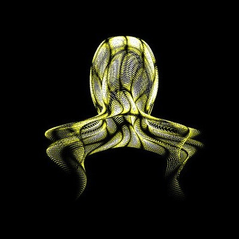
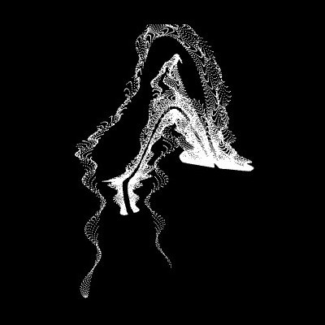

# ga-wasm

<p align="center">
  
  <br/>
  <strong>Some Generative Arts in WebAssembly</strong><br/>
  Based on <a href="https://x.com/yuruyurau/status/1865420201086636376" target="_blank">this Tweet</a>
</p>

<strong>You can see the compiled version at <a href="https://ariyan-eghbal.github.io/ga-wasm/" target="_blank">https://ariyan-eghbal.github.io/ga-wasm/</a></strong>

# Math notation 


$$
S(t) = \{(X(x,y,t), Y(x,y,t)) \mid x \in [0,199], y \in [0,199]\}
$$

Where:

$$
\begin{align*}
k(x) &= \frac{x}{8} - 12.5 \\
e(y) &= \frac{y}{8} - 12.5 \\
o(x,y) &= \frac{\text{mag}(k(x), e(y))^2}{169} \\
d(x,y) &= 0.5 + 5\cos(o(x,y)) \\
\text{mag}(k, e) &= \sqrt{k^2 + e^2} \\
\\
X(x,y,t) &= x + d(x,y) \cdot k(x) \cdot \sin(2d(x,y) + o(x,y) + t) + e(y) \cdot \cos(e(y) + t) + 100 \\
Y(x,y,t) &= o(x,y) \cdot 135 - \frac{y}{4} - 6d(x,y) \cdot \cos(3d(x,y) + 9o(x,y) + t) + 125
\end{align*}
$$

# Compile 
## install WASM target
```bash
rustup target add wasm32-unknown-unknown
```

## install wasm-pack
```bash
cargo install wasm-pack
```

## compile 
```bash
wasm-pack build --target web
```

# Run

Use a web server to serve contents of `www` directory
```bash
basic-http-server .
```

